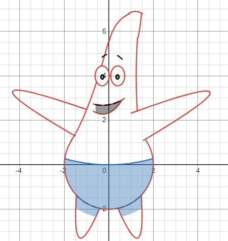
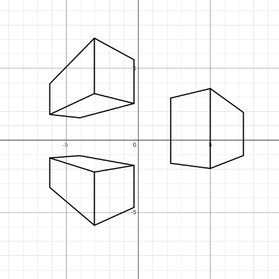
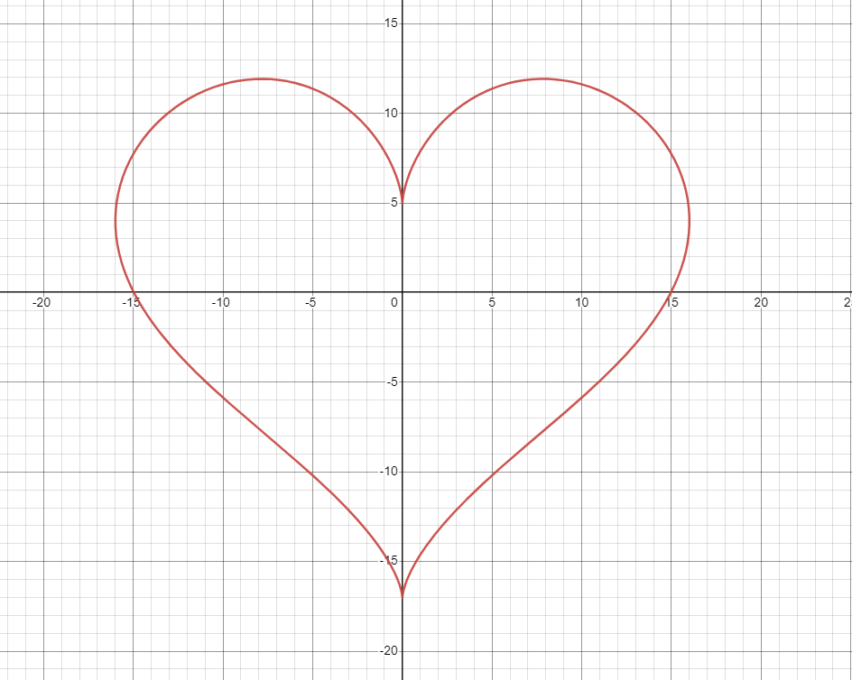

## What's Desmos?

[Desmos](https://www.desmos.com/calculator) is an online graphing calculator whos appeal is owed to its abundant array of features, empowering users to craft splendid creations solely through the foundation of mathematics.

## Basic Graphing Functions

If you're reading this, it's likely that you've gone through high school math, and perhaps even university-level math. Moving forward, I'll assume you have a grasp of first-year university mathematics. While I won't extensively delve into pure math, I will focus on how mathematical concepts intersect with art in this context.

###  Linear Functions

Linear functions are the simplest functions to both design and bound. In theory, a masterpiece could be indistinguishably approximated with sufficient linear functions given an infinitely powerful computer to render it on Desmos. However, due to computational restraints of the website and the amount of time it would to write (or generate) all linear functions, it's an infeasible method. Instead, we will use linear functions only for straight lines. This may be a promiment feature in the art depending on the theme. For example, a 2-point perspective city art will contain primarily straight lines, while organic drawings will contain almost none. 

Example:
$$ y = mx + b\cdot \{ |x - a_1| < a_2 \} $$

Patrick Star is curvy. 

{:width="200px" height="200px"}

Cubes aren't curvy without perspective distortion.

{:width="200px" height="200px"}

Fun fact: that linear function bounds can be entirely described with a single variable.

### Polynomial Functions

Polynomials show up often in math classes, but it's function in art is less pronounced. Most degrees of polynomials simply don't have an important shape in art aside from possibly the quadratic. And even so most shapes you see in real life that look like a quadratic aren't. For example Catenary functions better describe hanging chains than quadratics. Polynomials functions in Desmos art truly only shines in motion. 

Catenary
$$y = a \cosh\left(\frac{x}{a}\right)$$ 

vs 

Quadratics
$$ (y-y_1) = a(x-x_1)^2 $$

### Parametric Equations

Parametric equations introduce a pair of variables, usually denoted as $$x(t)$$ and $$y(t)$$, to define a curve. Parametric functions act most similar to how a hand would draw as they start at a point and move with some pattern, similar to an artist. Introducing piecewise definition to parametric functions allows one to draw art of unbounded complexity, but just like code it's important to ensure readability and not just have a "1-liner" in Desmos. This is so that sections can be reused or modified in the future. 

Here's an example of a parametric equation that generates a heart shape:

$$\left(16\left(\sin t\right)^{3},13\cos t-5\cos\left(2t\right)-2\cos\left(3t\right)-\cos\left(4t\right)\right)$$ 

{:width="300px" height="300px"}

### Rotational wrapper functions

### Splines

### Ellipses and circles

## Advanced Techniques

### Domain coloring

### Lag management

### 

### Animating with sliders

<iframe src="https://www.desmos.com/calculator/83xtqaav0s" width="100%" style="min-height:400px"></iframe>

### 3-D rendering

### Animating 3-D Graphing

<iframe src="https://www.desmos.com/calculator/yl7ftbic4g" width="100%" style="min-height:400px"></iframe>

### Physics engines

### Adding texture with Fourier and brownian noise

### Free style parametrics

## Artistic Vision in Desmos

### Knowing the limitations

### High density lossy rendering 

work in progress to be continued

## Interactive Graphing Calculator

Input your own mathematical expression (in terms of x) and see the graph below: (Parametric and Implicit functions coming soon)

<label for="expression">Expression:</label>
<input type="text" id="expression" value="sin(x)" size="30">
<button onclick="drawGraph()">Graph</button>

