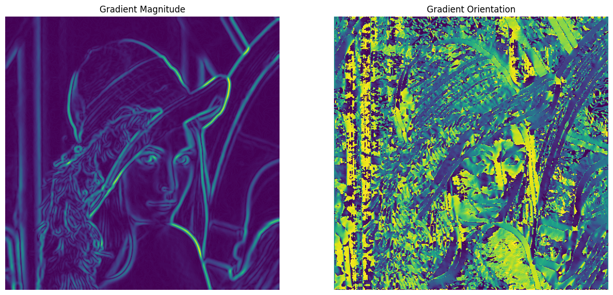
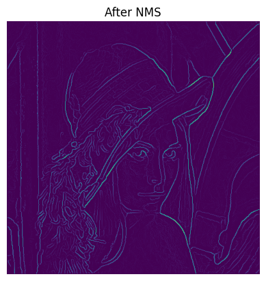
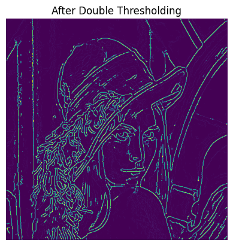
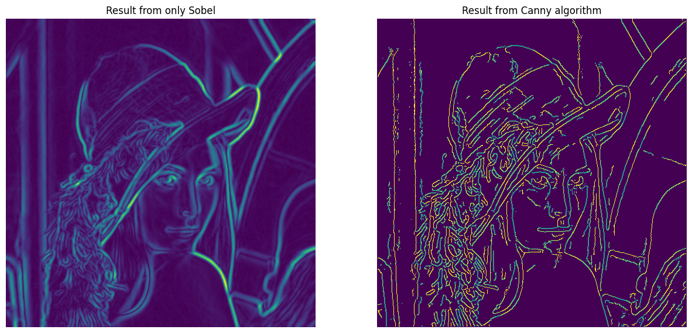

Xin chào các bạn,

Trong bài post về các [bộ lọc phần 2][này], mình đã giới thiệu về các bộ lọc cạnh và cũng như cách hoạt động của chúng. Ở phần này, mình sẽ giới thiệu một giải thuật cho kết quả vượt trội hơn các phương pháp trước có tên là Canny edge detection. Giải thuật này được phát triển bởi John F. Canny vào năm 1986. Nó bao gồm nhiều bước hậu xử lý để có thể cải thiện kết quả so với các phương pháp dựa vào đạo hàm.

### 1. Điểm yếu của việc dùng đạo hàm để tìm cạnh
Các bộ lọc như Sobel, Prewitt, Laplacian dựa vào **mỗi** giá trị gradient của pixel để  tìm ra cạnh. Tuy nhiên, trong ảnh thu được từ camera sẽ có rất nhiều nguồn nhiễu từ cả bên ngoài và bên trong, và điều này khiến cho các phương pháp này kém ổn đỉnh. 

### 2. Giải thuật Canny 
Giải thuật Canny về cơ bản bao gồm 5 bước. Chúng ta hãy cùng xem giải thuật này hoạt động như thế nào và code nó from scratch nhé.

**Bước 1**: Giảm nhiễu  
Để có thể giảm noise và tìm ra các cạnh đáng tin cậy, một bộ lọc thông thấp với mục đích làm mịn ảnh sẽ được áp dụng.

Bộ lọc có thể tùy ý lựa chọn, các bạn có thể chọn bộ lọc trung bình, trung vị, Gauss, bilateral, ... miễn là nó làm mịn ảnh. Ở đây mình sẽ dùng Gaussian filter để demo.

```python
import cv2
import matplotlib.pyplot as plt
import numpy as np

# Read image and turn into gray
# Can be replaced with any image

# Step 1: Gaussian Blur
image = cv2.imread("./lena.png", 0)
blurred = cv2.GaussianBlur(image)
```


**Bước 2**: Tính gradient và orientation

Ở bước này, ta sẽ dùng các bộ lọc như ở bài [này][này] để có tìm ra được các cạnh trong tấm ảnh. Các bạn có thể dùng bất kì bộ lọc gradient-based nào để tìm cạnh cũng được nhé.

Ở bước này, ta cần tính cường độ và hướng gradient tăng nhanh nhất (hướng của cạnh). Và điều này được tính theo công thức sau:

$$G = \sqrt{G_x^2 + G_y ^2}$$

$$\theta = arctan(\frac{G_y}{G_x})$$

```python

# Step 2: Find all edges
def sobelFilter(image):
    image_ = image.copy()/255.
    
    Gx = np.array([[-1, 0, 1], [-2, 0, 2], [-1, 0, 1]], dtype = np.float32)
    Gy = np.array([[-1, -2, -1], [0, 0, 0], [1, 2, 1]], dtype = np.float32)
    
    Ix = cv2.filter2D(image_, ddepth=-1, kernel = Gx)
    Iy = cv2.filter2D(image_, ddepth=-1, kernel=Gy)
    
    G = np.hypot(Ix, Iy)
    G = G/G.max()
    theta = np.arctan2(Iy, Ix)
    return G, theta/np.pi * 180

G, theta = sobelFilter(blurred)
```





**Bước 3**: Non-Max Suppression

Ở bước 2, chúng ta đã lọc ra được gần như tất cả các cạnh trong tấm ảnh, nhưng không phải tất cả chúng đều là cạnh. Vì thế, cần có một bước tắt (suppress) các điểm ảnh mà khả năng cao không phải là cạnh. 

Theta cho chúng ta biết hướng tăng nhanh nhất của gradient (tức là hướng của cạnh phát hiện được), vì vậy nếu tại hướng đó, giá trị biên độ đạo hàm là lớn nhất thì sẽ được giữ lại và nếu không phải thì ta sẽ set về 0. 

Với domain là ảnh, sẽ chỉ có 4 hướng cho một pixel: Hướng ngang, hướng chéo từ trái sang phải, hướng dọc từ trên xuống, hướng chéo từ phải sang trái. Và vì chỉ có 4 hướng nên ta sẽ chia thành các khoảng. Mình sẽ chia đều thành các khoảng như sau:

$$0 <= \theta <= 22.5 \text{  or } 157.5 < \theta <= 180 : \text{phương ngang}$$

$$22.5 < \theta <= 67.5: \text{phương chéo từ trái sang phải}$$

$$67.5 < \theta <= 112.5: \text{phương dọc từ trên xuống}$$

$$112.5 < \theta <= 157.5: \text{phương chéo từ phải sang trái}$$


**Code**

```python
def nonMaxSuppression(image, theta):
    if image.ndim > 2 or image.ndim < 2:
        raise "Image must be gray, 2D"
        
    M, N = image.shape
    Z = np.zeros_like(image)
    theta[theta<0] += 180
    
    for i in range(1, M-1):
        for j in range(1, N-1):
            if 0 <= theta[i, j] <= 22.5 or 157.5 <= theta[i, j] <= 180:
                firstValue = image[i, j-1]
                secondValue = image[i, j+1]
            elif 22.5 < theta[i, j] <= 67.5:
                firstValue = image[i-1, j-1]
                secondValue = image[i+1, j+1]
            elif 67.5 < theta[i, j] <= 112.5:
                firstValue = image[i-1, j]
                secondValue = image[i+1, j]
            else:
                firstValue = image[i-1, j+1]
                secondValue = image[i+1, j-1]
                
            if image[i, j] >= firstValue and image[i, j] >= secondValue:
                Z[i, j] = image[i, j]
            else:
                Z[i, j] = 0
    return Z

suppressed = nonMaxSuppression(G, theta)
```


**Bước 4**: Double Threshold

Ở bước 4 này, double threshold sẽ được áp dụng để phân các giá trị pixel ra thành 3 loại: edge, weak edge, not edge.


Như ở hình minh họa, nếu giá trị pixel lớn hơn maxVal ta sẽ gán là edge, dưới minVal là not edge, và ở giữa maxVal và minVal là weak edge.


**Code**

```python
def threshold(image, lowThreshold=0.03, highThreshold = 0.05):
    image = np.where(image>=highThreshold, 1., image)
    image = np.where(image<=lowThreshold, 0., image)
    return image

thresholded = threshold(suppressed, lowThreshold=0.02, highThreshold=0.075)
```



**Bước 5**: Edge Tracking by hysteresis

Ở bước này, với các weak edge nếu nằm gần strong edge sẽ được đổi thành edge và nếu xung quanh nó không có strong edge thì nó sẽ thành not edge, vì thường các cạnh sẽ được nối liền với nhau chứ không tách rời.

**Code**

```python
def hysteresis(image):
    image_ = image.copy()
    image_ = cv2.copyMakeBorder(image_, 1, 1, 1, 1, cv2.BORDER_CONSTANT, 0)
    for y in range(1, image_.shape[0]-1):
        for x in range(1, image_.shape[1]-1):
            if image_[y, x] > 0. and image_[y, x] < 1.:
                if image_[y-1, x-1] == 1. or image_[y-1, x] == 1. or image_[y-1, x+1] == 1. or \
                    image_[y, x-1] == 1. or image_[y, x+1] == 1. or image_[y+1, x-1] == 1. or \
                    image_[y+1, x] == 1. or image_[y+1, x+1] == 1.:
                    image_[y, x] = 1.
                else:
                    image_[y, x] = 0.
    return image_[1:-1, 1:-1]
image_ = hysteresis(thresholded)
```



Sau bước 5 này, ảnh kết quả sẽ có 2 giá trị với 0 là not edge và 1 là edge (các đường cam là do lỗi hiển thị). Mình để 2 ảnh nếu chỉ dùng Sobel và dùng Canny để minh họa. Và như các bạn thấy, các cạnh trong phương pháp Canny mỏng hơn và ít có nhiễu hơn so với bộ lọc Sobel. 

### 3. Lời kết

Trong phần này, chúng ta đã đi sâu vào việc giải thích và cùng xây dựng thuật toán Canny from scratch. Không chỉ là công cụ để tìm kiếm cạnh trong hình ảnh, thuật toán này còn có thể được sử dụng như một bước tiền xử lý quan trọng cho nhiều ứng dụng khác nhau trong xử lý ảnh, bao gồm việc tìm contours, phát hiện đường thẳng, ...

Việc hiểu rõ về cách hoạt động của thuật toán Canny không chỉ giúp chúng ta áp dụng nó hiệu quả vào các task khác của mình mà còn là cơ hội để nâng cao kiến thức về xử lý ảnh. Hy vọng rằng thông qua bài viết này, bạn đã có được cái nhìn tổng quan và sự hiểu biết sâu sắc hơn về thuật toán Canny và vai trò quan trọng của nó trong lĩnh vực xử lý ảnh.


### References
1\. [Canny Edge Detection - OpenCV](https://docs.opencv.org/4.x/da/d22/tutorial_py_canny.html)  
2\. [Canny Edge Detection Step by Step in Python - Computer Vision - Towards Data Science](https://towardsdatascience.com/canny-edge-detection-step-by-step-in-python-computer-vision-b49c3a2d8123)


[này]: https://mikyx-1.github.io/image_filters_p2/


