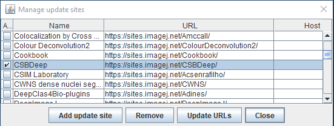
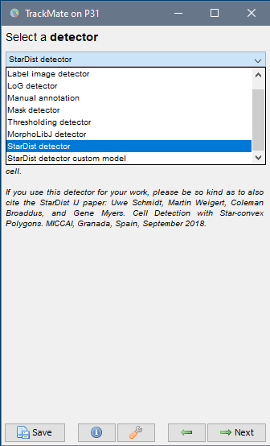
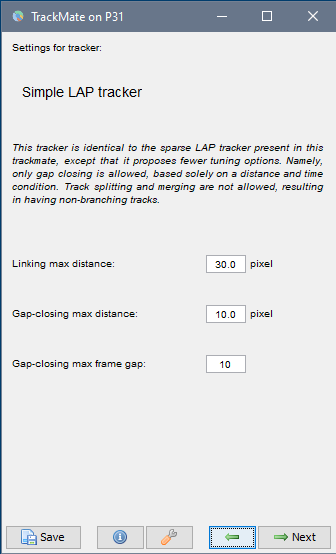
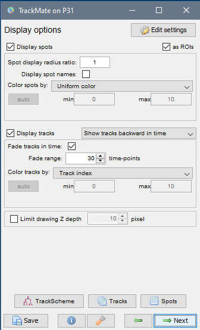
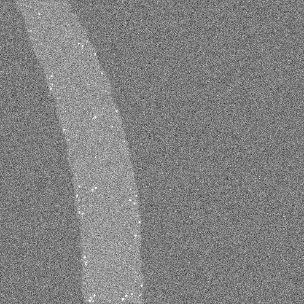

---
## Seminar
We organized our first image analysis seminar and a workshop on April 6th, 2022. 

Please click here to download <a href="/seminar_workkshop/Image analysis seminar_v10.pdf" download>Seminar Slides<a/>

---  
## Workshop
In this workshop, we will work through following exercises:
1. Segmentation using global threshold, local threshold and Deep Learning (StarDist)
2. Cell tracking using StarDist and TrackMate
3. Denoising using Noise2Void
4. Bonus – 3D segmentation using StarDist and TrackMate

### Installing appropriate plugins in your Fiji
We will be adding the following three [updates sites](https://imagej.net/update-sites/following) in our Fiji to install all the required plugins for this workshop:   
- [CSBDeep](https://imagej.net/plugins/csbdeep)
- [StarDist](https://imagej.net/plugins/stardist)
- [TrackMate-StarDist](https://imagej.net/plugins/trackmate/trackmate-stardist)  
  
Step 1: Start Fiji.  
Step 2: Select Help > Update... from the menu bar.  
Step 3: Click on the button "Manage update sites".  
Step 4: Scroll down the list and tick the checkboxes for update sites CSBDeep (shown below), StarDist and TrackMate-StarDist, then click the Close button.  
  

Step 5: Click on "Apply changes" to install the plugins.  
Step 6: Restart Fiji. StarDist plugin should now be available under Plugins > StarDist > StarDist 2D.  
  
---
### Workshop Exercise 1: Segmentation
[Download TIF file](seminar_workkshop/images/HT29_nuclei.tif)  
(Human HT29 colon cancer cells,  Image from [Broad Bioimage Benchmark Collection](https://bbbc.broadinstitute.org/BBBC008)) 
  
#### Global segmentation  
Open above image by dragging into the Fiji window and run Threshold command: <code>Image > Adjust > Threshold...</code>  
Choose different thresholding methods (such as Default, Huang, Otsu etc.) from the drop down list and check how they perform on your image.  
Once satisfied with a particular method or by manually selecting the lower and upper bounds (sliders), click on Apply button to generate a thresholded image.  

All thresholding methods (such as Default, Huang, Otsu etc.) can be tested at once by using <code>Image > Adjust > Auto Threshold</code>  
  
#### Local segmentation  
Select your original image and run the command: <code>Image > Adjust > Auto Local Threshold</code>  
Run with "Try all" methods to check which one gives the best result. For this image, the best segmentation is achieved with the *Phansalkar* method  

#### Deep Learning based segmentation using [StarDist](https://imagej.net/plugins/stardist)  
Select your original image and run the command: <code>Plugins › StarDist › StarDist 2D</code>  
In the follow up menu, choose Model: Versatile (fluorescent nuclei) and click on the "Set optimized thresholds" tab at the bottom. Keep the other deafult options. Click on OK.  
A segmentation label image will be genrated with the nuclei ROIs added to the ROI Manager.  

---  

### Workshop Exercise 2: Tracking cancer cell migration  

  
Cancer cell migration, https://doi.org/10.5281/zenodo.5206107

[Download TIF file](seminar_workkshop/images/P31.tif)
  
- Open above time-lapse sequence in Fiji and run the command: <code> Plugins › Tracking › TrackMate</code>  
- You will be presented with a *TrackMate* window. Click Next.  
- Select *StarDist detector* from the drop-down menu (image A below). Click next.  
- You can now click on the *Preview* tab, to see how well StarDist is doing in detecting the nuclei on the current slice. If detections look fine, click next to detect nuclei in the whole time-lapse sequence.  
- Keep clicking next button until you reach the *Select a tracker* option (image B below). Select *Simple LAP tracker* and click next.  
- In the settings, choose Linking max distance=30 pixel, Gap-closing max distance=10 pixel, Gap-closing max frame gap=10. Click next.  
- Keep clicking next until you reach the *Display options* (image C below). Here, various display options fir the tracks could be selected. Choose *Show tracks backward in time*.  
- Please explore the three tabs at the bottom - *TrackScheme*, *Tracks* and *Spots*. A lot of statistics is hidden there, such as raw values for each nuclei in each frame of the time-lapse. All the statistics could be exported to a CSV file.  
- Keep clicking next until you reach the last window called *Select an action*. Select *Capture overlay* and click *Execute* to generate a time-lapse movie with spots and tracks overlaid on top of the original data.  
- A label time-lapse movie could also be generated by selecting *Export label image* from the drop-down list and clicking *Execute*  
  
| A | B | C |
| - | - | - | 
|  |  |  |

  
---

### Workshop Exercise 3: Denoising using Noise2Void  

| Original | Noise2Void |
| - | - |
|  |  | 

FISH in C. elegans, Spinning disk confocal, image courtesy of [ABRF/LMRG Image Analysis Study](https://sites.google.com/view/lmrg-image-analysis-study)  

[Download TIF file](seminar_workkshop/images/fish4_celegans.tif)  
  
- Open above Z-stack in Fiji and run the command: <code> Plugins › CSBDeep › N2V › N2V train + predict</code>  
- You will be presented with a *N2V train + predict* window. Choose the following options:
  - Axes of prediction input: XYZ
  - Number of epochs: 10
  - Number of steps per epoch: 10
  - Batch size per step: 64
  - Patch shape: 64
  - Neighborhood readius: 5
- Click OK. A window showing the progress of different steps (Preparation, Training and Prediction) will open. As the training progresses, training loss (red) and validation loss (blue) curves are displayed in the window (see below). If the training goes well, then both the red and blue curves will decrease with more cycles (epochs) of training and stabilize around a minimum loss value (~ 1.0 in the image below). Training loss goes down from the beginning but Validation loss (blue curve) usually goes up in the beginning and then comes down and approaches the red curve.

  
  
  If red and blue curves are do not stabilize to a minimum loss value, then incease the number of epochs to 20 or 30 and then run the <code>N2V train + predict</code> again.
- After program finishes, it generates a denoised Z-stack from the trained model. You might need to run <code>Image › Adjust › Brightness/Contrast...</code> and hit <code>Reset</code> to adjust the display of the denoised image.
- Trained model could be saved as a .ZIP file (to be used for prediction in the future) by clikcing on the <code>File actions > Save to...</code>
  
  
- Trained model could also be applied immediately on a single noisy image or a folder full of noisy images by using <code>Predict > Single image or stack</code> or <code>Predict > Folder of images of stacks</code> options, respectively.  
  
  
  
---
### Bonus Workshop Exercise 4: 3D segmentation using TrackMate (StarDist)
  
  
  
  
  
  
  
  
  
  
  

